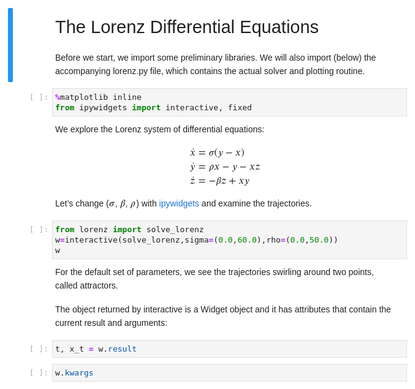

# Asciidoctor Jupyter Converter

A Jupyter converter for Asciidoctor.js. Write your Notebook in AsciiDoc!


[](https://www.npmjs.com/package/asciidoctor-jupyter)

## Install

    $ npm i asciidoctor-jupyter

## Usage

In order to use this converter, you will need to install [Asciidoctor.js](https://docs.asciidoctor.org/asciidoctor.js/latest/setup/install/).
Verify that the `asciidoctor` command is now available on your `PATH` by running:

    $ asciidoctor -v

### From the CLI (Command Line Interface)

To convert an AsciiDoc file to a Jupyter Notebook, open a terminal and type:

    $ asciidoctor -r asciidoctor-jupyter notebook.adoc

The above command will generate a file named `notebook.ipynb`.

### From the API

```js
const asciidoctor = require('@asciidoctor/core')()
const JupyterConverter = require('asciidoctor-jupyter')

// register the converter
asciidoctor.ConverterFactory.register(JupyterConverter, ['jupyter'])

// convert an AsciiDoc file
asciidoctor.convertFile('notebook.adoc', { backend: 'jupyter' })
```

## Write your Notebook

Here's a basic example of notebook written in AsciiDoc:

```adoc
= The Lorenz Differential Equations
:jupyter-language-name: python
:jupyter-language-version: 3.7.8
:url-ipywidgets: https://ipywidgets.readthedocs.io/en/stable/

Before we start, we import some preliminary libraries.
We will also import (below) the accompanying `lorenz.py` file,
which contains the actual solver and plotting routine.

[source,python]
----
%matplotlib inline
from ipywidgets import interactive, fixed
----

We explore the Lorenz system of differential equations:

[latexmath]
++++
\begin{aligned}
\dot{x} & = \sigma(y-x) \\
\dot{y} & = \rho x - y - xz \\
\dot{z} & = -\beta z + xy
\end{aligned}
++++

Let's change (stem:[\sigma], stem:[\beta], stem:[\rho]) with {url-ipywidgets}[ipywidgets] and examine the trajectories.

[source,python]
----
from lorenz import solve_lorenz
w=interactive(solve_lorenz,sigma=(0.0,60.0),rho=(0.0,50.0))
w
----

For the default set of parameters, we see the trajectories swirling around two points, called attractors.

The object returned by `interactive` is a `Widget` object and it has attributes that contain the current result and arguments:

[source,python]
----
t, x_t = w.result
----

[source,python]
----
w.kwargs
----
```

And here's the result:



## Notebook file format

This converter generates [Jupyter notebooks] using [Notebook file format](https://nbformat.readthedocs.io/en/latest/format_description.html) version 4.4.
